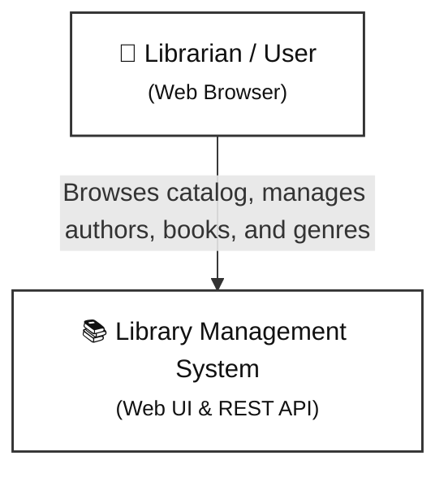
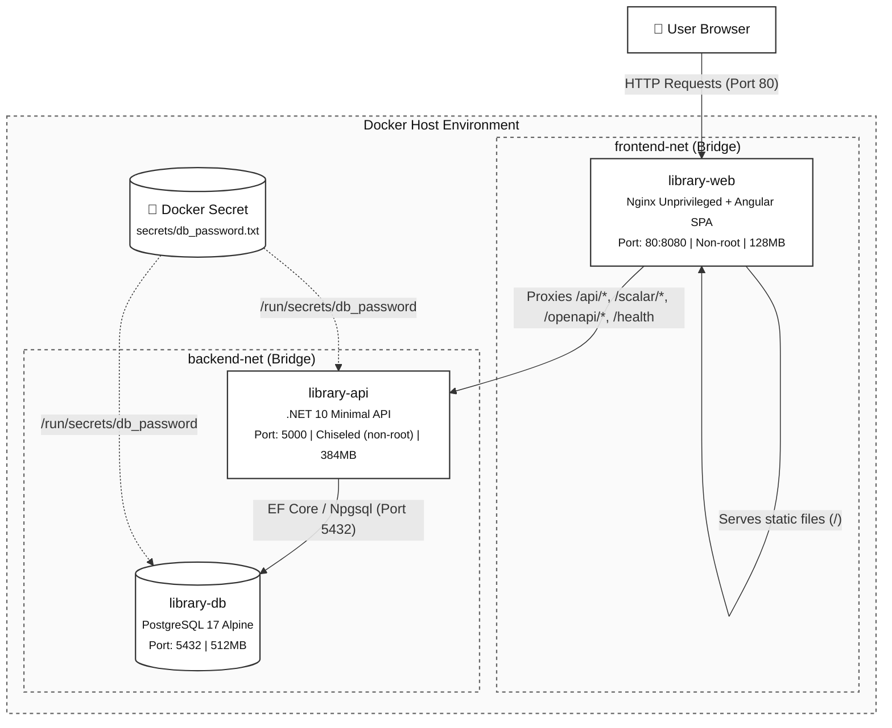
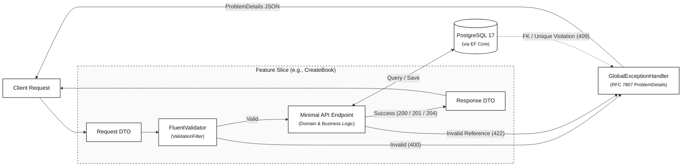

# System Architecture & Technical Decisions

This document outlines how the **Library Management System** is structured, how its parts communicate, and the reasoning behind our key architectural and security choices.

---

## 1. System Overview

The system is a full-stack library management application designed for speed, clarity, operational security, and ease of maintenance.
- **Frontend**: Single-page application built with modern Angular 22 (using Standalone Components and native Signals).
- **Backend**: RESTful API built on .NET 10 Minimal APIs using a Vertical Slice / REPR (Request-Endpoint-Response) approach with OpenAPI 3.1 & Scalar documentation.
- **Database**: PostgreSQL 17 managed through Entity Framework Core with strict foreign key constraints and projection-optimized queries.
- **Security & Hardening**: Secrets managed via Docker secrets (`/run/secrets/db_password`), distroless chiseled runtime containers, unprivileged non-root execution (`USER $APP_UID`, `nginx-unprivileged`), container privilege restrictions (`no-new-privileges:true`), and explicit memory limits.
- **Infrastructure**: Containerized with Docker and served behind an Nginx reverse proxy with gzip compression and defense-in-depth HTTP security headers.

---

## 2. Architecture Diagrams

To keep these diagrams clear and easy to read, they use clean, monochrome notation focused on responsibility boundaries, runtime topology, and data flow.
*(Note: Diagrams are specified in [Mermaid](https://mermaid.js.org/). If your viewer does not render them automatically, view this file on GitHub or via [Mermaid Live](https://mermaid.live/).)*

### 2.1. System Context Diagram
A high-level view of who uses the system and the single touchpoint they interact with.



---

### 2.2. Container Diagram (Runtime Topology)
Illustrates how individual containers, services, network bridges, and secrets connect in Docker Compose.



---

### 2.3. Backend Slice Anatomy (REPR & Error Flow)
Shows what happens inside the backend when an API request arrives. Each feature is self-contained with integrated validation and centralized RFC 7807 error handling.



---

## 3. Design Decisions & Practical Reasoning

We favored pragmatic solutions that optimize for developer productivity, operational security, readability, and long-term maintainability without unnecessary complexity.

### 3.1. Vertical Slice Architecture over Traditional Layered (N-Tier) Architecture

- **The Choice**: Grouping code by business feature (e.g., `Features/Books/CreateBook`, `Features/Books/GetBooks`) rather than technical layers (`Controllers/`, `Services/`, `Repositories/`).
- **Why this is better for us**:
  - In a traditional layered architecture, making a simple change (like adding a field to a book) forces you to jump between 5 or 6 different folders across projects.
  - With Vertical Slices, everything needed to understand or change an operation lives together in one folder: the endpoint, the request, the response, and the validation rule.
  - If a feature is deprecated, deleting that single folder removes all traces of it without risking breakages in shared, bloated service classes.
- **Trade-off accepted**: Small amounts of DTO duplication between slices are tolerated. We prefer minimal duplication over premature and rigid shared abstractions.

---

### 3.2. Minimal APIs over Controller-Based APIs

- **The Choice**: Building REST endpoints using .NET 10 Minimal APIs rather than traditional ASP.NET Core MVC Controllers.
- **Why this is better for us**:
  - **Lower Overhead & Better Performance**: Minimal APIs bypass the heavy MVC pipeline (reflection-heavy controller discovery, action invokers, and legacy filter pipelines). This results in faster cold starts and lower memory consumption—ideal for containerized runtimes.
  - **No More "Fat Controllers" or Constructor Bloat**: Dependencies are injected directly into each endpoint handler, so each endpoint only receives what it actually needs.
  - **Natural Fit for Feature-Driven Slices**: Route definitions live right alongside their request, response, and validation logic inside their specific feature slice folder via extension methods (`group.MapCreateBook()`).
  - **Modern, Fluent Endpoint Filters**: Cross-cutting concerns—such as running FluentValidation rules and returning RFC 7807 problem details—are handled cleanly using endpoint filters without the ceremony of global MVC action filters.

---

### 3.3. Angular Signals over Heavy RxJS / NgRx State Management

- **The Choice**: Using native Angular Signals (`signal()`, `computed()`, `effect()`, `input()`, `output()`) for component and service reactivity instead of complex global state stores (like NgRx) or sprawling RxJS stream pipelines.
- **Why this is better for us**:
  - RxJS is effective for complex asynchronous event streams, but managing everyday UI state with it often introduces memory leaks (forgotten unsubscriptions), confusing operator chains (`switchMap`, `combineLatest`, `tap`), and heavy boilerplate.
  - Signals read like standard synchronous JavaScript values while automatically triggering fine-grained UI updates when values change.
  - Any developer familiar with TypeScript can read and understand the frontend code in minutes without needing expertise in reactive stream programming.

---

### 3.4. Containerized Docker Compose & Nginx Proxy over Direct Local Hosting

- **The Choice**: Running PostgreSQL, the .NET backend, and the Angular frontend together via Docker Compose, fronted by an Nginx reverse proxy.
- **Why this is better for us**:
  - Eliminates *"it works on my machine"* friction. Any contributor can run `docker compose up --build` and have an identical, functioning environment with databases pre-migrated and seeded.
  - Nginx handles static file delivery, gzip compression, security headers, and proxies `/api/*`, `/scalar/*`, `/openapi/*`, and `/health` requests directly to the backend container.
  - Solves **CORS** (Cross-Origin Resource Sharing) issues naturally: both the frontend app and the API share the same origin port (`localhost:80`) from the browser's perspective.

---

### 3.5. PostgreSQL over Microsoft SQL Server

- **The Choice**: PostgreSQL 17 (via the `Npgsql.EntityFrameworkCore.PostgreSQL` provider) rather than Microsoft SQL Server.
- **Why this is better for us**:
  - **Lightweight & Container-Friendly**: The `postgres:17-alpine` Docker image is under 50 MB, spins up in seconds, and uses minimal memory. In contrast, SQL Server container images are significantly heavier (often >1 GB) and have compatibility quirks on non-x86 platforms (like Apple Silicon).
  - **Zero Licensing Costs & True Open Source**: PostgreSQL gives complete freedom from database tier limits (such as SQL Server Express RAM/database size caps) and expensive production enterprise licenses.
  - **First-Class .NET Support**: The Npgsql EF Core provider is one of the fastest and most actively maintained database drivers in the .NET ecosystem, offering full feature parity with standard EF Core tooling and migrations.
  - **Rich Relational Features**: Robust ACID guarantees, strict foreign key constraints, native UUID handling (`gen_random_uuid()`), and case-insensitive pattern matching (`EF.Functions.ILike`).

---

### 3.6. Docker Secrets Management over Plain-Text Environment Variables

- **The Choice**: Storing sensitive database credentials in ephemeral Docker secrets (`secrets/db_password.txt` mounted as `/run/secrets/db_password`) rather than plaintext environment variables (`POSTGRES_PASSWORD=...`).
- **Why this is better for us**:
  - Environment variables are easily leaked: they appear in `docker inspect`, container process tables (`/proc/<pid>/environ`), CI/CD logs, and crash dumps.
  - Docker secrets mount credentials as read-only files in a secure in-memory `tmpfs` filesystem accessible only to authorized containers.
  - The .NET backend dynamically detects and reads `/run/secrets/db_password` at startup in `ServiceExtensions.cs`, updating the connection string securely without ever exposing the password in configuration files.
  - **Zero-Friction Evaluation with Rotation Capability**: To ensure immediate, zero-step evaluation, a default development secret is tracked in `secrets/db_password.txt`. For production environments or credential rotation, companion scripts (`init-secrets.sh` for Unix/macOS, `init-secrets.ps1` for Windows) support `--force` / `-Force` flags to generate high-entropy 24-byte random secrets on demand.


---

### 3.7. Container Hardening & Distroless (Chiseled) Images

- **The Choice**: Deploying the backend on Microsoft's Ubuntu Chiseled image (`mcr.microsoft.com/dotnet/aspnet:10.0-noble-chiseled`) and the frontend on `nginxinc/nginx-unprivileged:alpine`, with strict container security constraints.
- **Why this is better for us**:
  - **Attack Surface Minimization**: Chiseled containers are distroless: they contain only the .NET runtime and minimal OS dependencies. They contain no package managers (`apt`), no shell (`/bin/sh`, `/bin/bash`), and no standard utilities that an attacker could leverage during container escape attempts.
  - **Non-Root Execution**: Both services execute as unprivileged users (`USER $APP_UID` in .NET, non-root user in Nginx on port 8080).
  - **Privilege Escalation Prevention**: All containers enforce `security_opt: [no-new-privileges:true]`, preventing child processes from gaining elevated privileges.
  - **Resource Isolation**: Explicit memory limits (`limits.memory`: 512MB for Postgres, 384MB for API, 128MB for Web) protect the host against denial-of-service and memory starvation.

---

### 3.8. Relational Integrity & Restrictive Delete Strategy

- **The Choice**: Enforcing `DeleteBehavior.Restrict` on foreign key relationships between Books and Authors/Genres, coupled with centralized exception translation in `GlobalExceptionHandler`.
- **Why this is better for us**:
  - Cascading deletes (`CASCADE`) risk catastrophic data loss: accidentally deleting an author would silently wipe all associated books from the catalog.
  - Restricting deletes protects catalog integrity at the database engine level, ensuring orphaned records cannot be created regardless of the calling path.
  - When a deletion is attempted on an entity with existing book associations, PostgreSQL raises a foreign key violation (`23503`). The backend's `GlobalExceptionHandler` intercepts this error and returns a clean, human-readable RFC 7807 `409 Conflict` response:
    ```json
    {
      "type": "https://httpstatuses.com/409",
      "title": "Conflict",
      "status": 409,
      "detail": "Cannot delete this record because it has dependent records. Remove all associated books first."
    }
    ```

---

### 3.9. Projection-Based EF Core Queries (N+1 Query Elimination)

- **The Choice**: Querying entity relationships through LINQ `.Select()` projections into flat DTOs rather than eager loading (`.Include()`) or lazy loading.
- **Why this is better for us**:
  - Eager loading (`.Include(b => b.Author).Include(b => b.Genre)`) frequently results in Cartesian products and transfers unneeded columns over the wire.
  - Lazy loading causes the notorious N+1 query problem, issuing separate database queries for every row rendered in a table.
  - Projections generate a single, highly efficient SQL query with standard `INNER JOIN` clauses, selecting only the exact columns required by the client:
    ```csharp
    var items = await query
        .Skip((request.Page!.Value - 1) * request.PageSize!.Value)
        .Take(request.PageSize!.Value)
        .Select(b => new GetBooksResponseItem(
            b.Id,
            b.Title,
            b.ISBN,
            b.PublishedYear,
            b.Author.Name,
            b.Genre.Name))
        .ToListAsync(ct);
    ```
