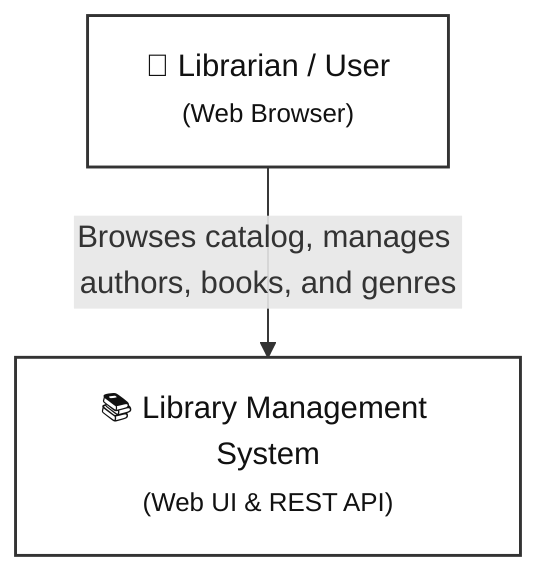
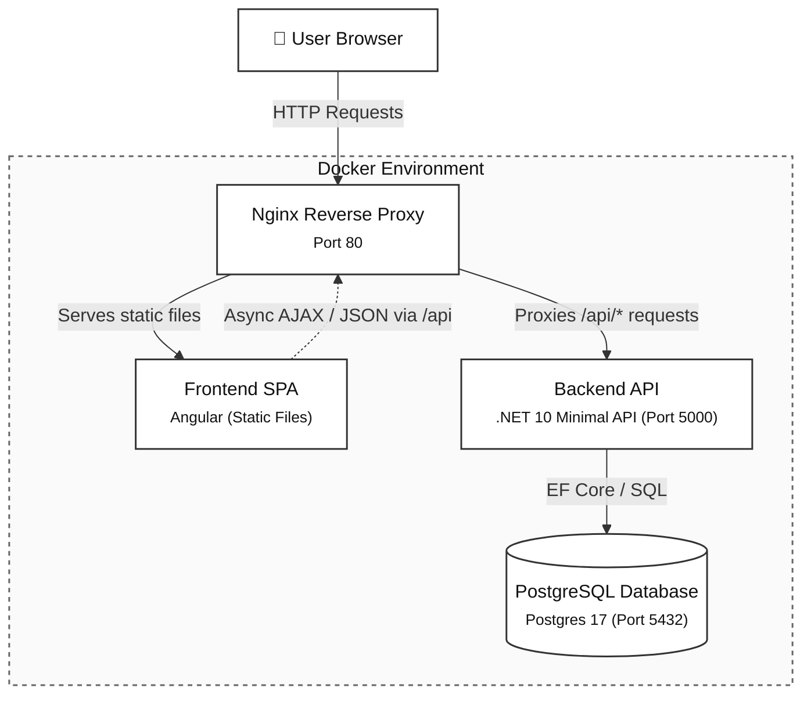
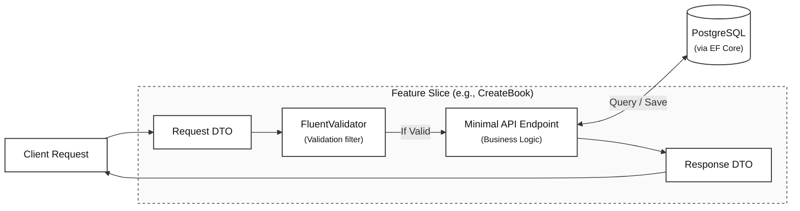

# System Architecture & Technical Decisions

This document outlines how the **Library Management System** is structured, how its parts communicate, and the reasoning behind our key architectural choices.

---

## 1. System Overview

The system is a full-stack library management application designed for speed, clarity, and ease of maintenance.
- **Frontend**: Single-page application built with modern Angular (using Standalone Components and Signals).
- **Backend**: RESTful API built on .NET 10 Minimal APIs using a Vertical Slice / REPR approach with OpenAPI & Scalar documentation.
- **Database**: PostgreSQL 17 managed through Entity Framework Core.
- **Infrastructure**: Containerized with Docker and served behind an Nginx reverse proxy.

---

## 2. Architecture Diagrams

To keep these diagrams clear and easy to read, they use clean, monochrome notation focused on responsibility boundaries and data flow.

### 2.1. System Context Diagram
A high-level view of who uses the system and the single touchpoint they interact with.

---

### 2.2. Container Diagram (Runtime Topology)
Illustrates how the individual containers and services connect together in local development and production.

---

### 2.3. Backend Slice Anatomy (REPR Flow)
Shows what happens inside the backend when an API request arrives. Each feature is self-contained.

---

## 3. Design Decisions & Practical Reasoning

We favored pragmatic solutions that optimize for developer productivity, readability, and long-term maintainability without overengineering.

### 3.1. Vertical Slice Architecture over Traditional Layered (N-Tier) Architecture

- **The Choice**: Grouping code by business feature (e.g., `Features/Books/CreateBook`, `Features/Books/GetBooks`) rather than technical layers (`Controllers/`, `Services/`, `Repositories/`).
- **Why this is better for us**:
  - In a traditional layered architecture, making a simple change (like adding a field to a book) forces you to jump between 5 or 6 different folders across projects.
  - With Vertical Slices, everything needed to understand or change an operation lives together in one folder: the endpoint, the request, the response, and the validation rule.
  - If a feature is deprecated, deleting that single folder removes all traces of it without risking breakages in shared, bloated service classes.
- **Trade-off accepted**: You might see small bits of repeated code between slices. We prefer a little duplication over premature and rigid shared abstractions.

---

### 3.2. Minimal APIs over Controller-Based APIs

- **The Choice**: Building our REST endpoints using .NET 10 Minimal APIs rather than traditional ASP.NET Core MVC Controllers.
- **Why this is better for us**:
  - **Lower Overhead & Better Performance**: Minimal APIs bypass the heavy MVC pipeline (reflection-heavy controller discovery, action invokers, and legacy filter pipelines). This results in faster application cold-starts and lower memory consumption—ideal for containerized runtimes.
  - **No More "Fat Controllers" or Constructor Bloat**: In traditional controllers, 10 different actions share a single constructor. If Action A needs a logger and Action B needs an email service, the controller constructor ends up injecting everything. With Minimal APIs, dependencies are injected directly into each endpoint handler, so each endpoint only receives what it actually needs.
  - **Natural Fit for Feature-Driven Slices**: Instead of dumping all book-related routes into a massive 500-line `BooksController`, each route definition lives right alongside its request, response, and validation logic inside its specific feature slice folder.
  - **Modern, Fluent Endpoint Filters**: Cross-cutting concerns—such as running FluentValidation rules and returning RFC 7807 problem details—are handled cleanly using endpoint filters without the ceremony of global MVC action filters.

---

### 3.3. Angular Signals over Heavy RxJS / NgRx State Management

- **The Choice**: Using modern Angular Signals (`signal()`, `computed()`, `effect()`) for component and service reactivity instead of complex global state stores (like NgRx) or sprawling RxJS stream pipelines.
- **Why this is better for us**:
  - RxJS is great for complex event streams, but managing everyday UI state with it often introduces memory leaks (forgotten unsubscriptions), confusing operator chains (`switchMap`, `combineLatest`, `tap`), and heavy boilerplate.
  - Signals read like standard synchronous JavaScript values while automatically triggering precise UI updates when values change.
  - Any developer familiar with basic TypeScript can read and understand the frontend code in minutes without needing expertise in reactive stream programming.

---

### 3.4. Containerized Docker Compose & Nginx Proxy over Direct Local Hosting

- **The Choice**: Running PostgreSQL, the .NET backend, and the Angular frontend together via Docker Compose, fronted by an Nginx reverse proxy.
- **Why this is better for us**:
  - Eliminates the classic *"it works on my machine"* friction. Any contributor can run `docker-compose up --build` and have an identical, functioning environment with databases pre-migrated and ready.
  - Nginx handles static file delivery and proxies `/api/*` requests directly to the backend container.
  - This solves **CORS** (Cross-Origin Resource Sharing) issues naturally: both the frontend app and the API share the same origin port (`localhost:80`) from the browser's perspective.

---

### 3.5. PostgreSQL over Microsoft SQL Server

- **The Choice**: PostgreSQL (via the `Npgsql.EntityFrameworkCore.PostgreSQL` provider) rather than Microsoft SQL Server.
- **Why this is better for us**:
  - **Lightweight & Container-Friendly**: The `postgres:17-alpine` Docker image is under 50 MB, spins up in seconds, and uses minimal memory. In contrast, SQL Server container images are significantly heavier (often >1 GB) and have historically suffered from resource overhead and compatibility quirks on non-x86 platforms (like Apple Silicon).
  - **Zero Licensing Costs & True Open Source**: PostgreSQL gives us complete freedom from database tier limits (such as SQL Server Express RAM/database size caps) and expensive production enterprise licenses. It runs identically on any cloud (AWS RDS, GCP Cloud SQL, Azure Database for PostgreSQL) or self-hosted Linux container.
  - **First-Class .NET Support**: The Npgsql EF Core provider is one of the fastest, most reliable, and actively maintained database drivers in the .NET ecosystem, offering full feature parity with standard EF Core tooling and migrations.
  - **Rich Feature Set**: We get robust relational ACID transactions, strict foreign key constraints (preventing orphan records), native UUID handling, and future-proof capabilities like JSONB and full-text search without needing expensive enterprise add-ons.
